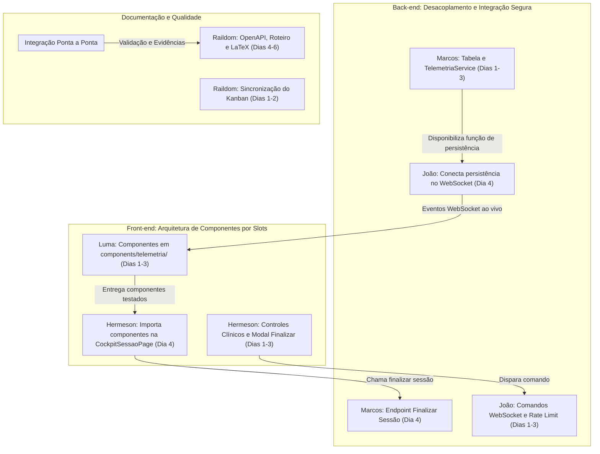

# Sprint 9 Detalhada: Gestão de Sessão Terapêutica e Telemetria em Tempo Real

> **Período planejado:** 01/10/2026 a 08/10/2026  
> **Tema da Sprint:** Gestão de Sessão Terapêutica, Ingestão de Telemetria Contínua e Cockpit do Terapeuta  
> **Composição da equipe:** 2 Back-end, 2 Front-end, 1 Documentação / Qualidade  
> **Requisitos centrais do PDF:** RF12 (Gestão de Sessão), RF13 (Ciclo da Sessão), RF17 (Contexto DDA), RF21 (Autoria Obrigatória), RN01, RN02, RN03, RN04, RN05  

---

## 1. Visão Geral e Contexto da Sprint 9

A **Sprint 9** consolida o núcleo operacional do ecossistema InTEA. Enquanto a Sprint 8 estabeleceu o canal de comunicação inicial (*handshake* e pareamento remoto com geração de `session_token`), a Sprint 9 orquestra a **sessão clínica ativa em tempo real**:

1. **Início e Transição de Estado:** A sessão sai de `conectado` e transiciona para `em_andamento`, disparando o cronômetro clínico e o cockpit de monitoramento.
2. **Ingestão e Roteamento de Telemetria:** O jogo terapêutico no dispositivo externo (tablet/VR) envia pacotes contínuos de eventos via WebSocket. O backend valida a estrita conformidade com o manifesto do jogo (**RN02**) e despacha os dados ao vivo para a tela do terapeuta.
3. **Cockpit do Terapeuta (Controle em Tempo Real):** O terapeuta visualiza o engajamento do paciente, recebe alertas de conectividade/bateria do tablet, pode enviar comandos ao jogo (pausa, marcadores clínicos) e acionar a interrupção assistida.
4. **Finalização e Sumarização Clínica:** Ao término da sessão, o ciclo é formalmente encerrado (`finalizada`), calculando a duração total e preparando os dados estruturados para a Tela de Resultados (Sprint 10).
5. **Garantia de Regras Invioláveis:** Sessões em modo livre não persistem telemetria em prontuário (**RN01**), dados clínicos são protegidos por autoria (**RF21**) e o histórico possui imutabilidade com bloqueio de hard delete (**RN05**).

---

## 2. Composição da Equipe e Responsáveis

| Papel | Integrante Responsável | GitHub | Foco Estrutural na Sprint 9 |
| :--- | :--- | :--- | :--- |
| **Back-end 1** | **Marcos Willian** | `@MarcosWillianAP1K` | Ciclo de vida da sessão, persistência de telemetria, finalização e auditoria clínica |
| **Back-end 2** | **João Marcos** | `@JM3L0` | Roteamento WebSocket de telemetria, comandos remotos, resiliência e rate limit |
| **Front-end 1** | **Hermeson Alves** | `@Hermeson69` | Cockpit da sessão em andamento, cronômetro, controles clínicos e encerramento |
| **Front-end 2** | **Luma Maiara** | `@lumamaiara` | Visualização de telemetria ao vivo, alertas de link/bateria, store e persistência |
| **Documentação / Qualidade** | **Raildom Silva** | `@Raildom` | Seção 7.9 LaTeX, especificação OpenAPI, roteiro de testes CT-S07..CT-S14 e Kanban |

---

## 3. Regularização de Tarefas das Sprints Anteriores (Dívidas Técnicas / Atrasos)

A auditoria no GitHub Projects identificou tarefas que necessitam de regularização formal durante esta sprint:

### 3.1 Tarefas Prontas no Código que Devem Ser Movidas para `CLOSED` no GitHub:
* **Back-end 2 (João Marcos):**
  * `Issue #17`: `Back: Filtro por Objetivo e Paginação de Jogos` (100% testado em `filtro_paginacao.test.ts`).
  * `Issue #47`: `Back: Endpoint de Handshake de Pareamento Remoto` (Mergeado e ativo na API).
  * `Issue #48`: `Back: Gateway de WebSocket para Notificação em Tempo Real` (Operacional no Socket.IO).
  * `Issue #49`: `Back: Heartbeat e Detecção de Queda de Conexão Remota` (Validado com testes de queda).
  * `Issue #50`: `Back: Testes Automatizados de Pareamento e Regressão` (173 testes verdes).
* **Front-end (Hermeson / Luma):**
  * `Issue #19`: `Front: Estrutura Modular da Feature de Pacientes` (Módulo ativo).
  * `Issue #28` & `#29`: `Front: Filtros Clínicos e Integração com Vitest` (Página e testes operacionais).
  * `Issue #55`, `#56`, `#57`, `#58`: `Front: Cliente WebSocket, Store Reativa e Modal` (60 testes verdes no Vitest).

### 3.2 Tarefas em Atraso Real para Regularização Imediata (Documentação - Raildom):
* `Issue #32`: Atualização formal dos Diagramas ER, Classes e Sequência no documento do projeto.
* `Issue #59`: Redação oficial da Seção 7.8 (Sprint 8) no relatório acadêmico LaTeX.
* `Issue #60`: Atualização completa da documentação OpenAPI com os endpoints de pareamento.
* `Issue #62`: Coleta de capturas de tela e evidências visuais do fluxo de pareamento.

---

## 4. Detalhamento de Tarefas e Fronteiras de Arquivos (Zero Conflito de Merge)

> [!IMPORTANT]
> **Protocolo Anti-Conflito da Equipe InTEA (Lição Aprendida da Sprint 8):**  
> Na Sprint 8, ocorreram conflitos graves de merge porque dois desenvolvedores do backend alteraram simultaneamente os mesmos arquivos (`sessao.routes.ts`, `sessao.controller.ts`, `sessao.model.ts`).  
> Para a Sprint 9, **a fronteira de arquivos é estritamente demarcada**:
> 1. Cada integrante possui **arquivos de domínio exclusivo**.
> 2. É expressamente **proibido alterar arquivos fora do seu domínio**.
> 3. Nos pontos onde há dependência funcional, a ordem de quem faz primeiro está **fixada abaixo com datas e estratégias de mock**.

---

### 4.1 Back-end 1: Marcos Willian (`@MarcosWillianAP1K`)
*Foco: Banco de Dados, Persistência de Telemetria, Encerramento e Auditoria Clínica*

* **Domínio Exclusivo de Arquivos:**
  * `Database/migrations/003_telemetria_e_auditoria.sql`
  * `Backend/api/sessao/controllers/sessao.controller.ts` *(apenas método `finalizarSessao`)*
  * `Backend/api/sessao/routes/sessao.routes.ts` *(apenas rota `POST /api/sessao/:id/finalizar`)*
  * `Backend/api/sessao/services/sessao-finalizar.service.ts`
  * `Backend/api/telemetria/*` *(novo módulo isolado: model, service, validator, dto)*
  * `Backend/api/auditoria/*` *(novo módulo isolado: model, middleware)*
  * `Backend/api/sessao/test/sessao_finalizar.test.ts` e `Backend/api/telemetria/test/*`
* **Zona Proibida (NÃO EDITAR):**
  * `Backend/core/websocket/*` *(exclusivo de João Marcos)*
* **Ordem de Execução:**
  * **Faz PRIMEIRO (Dias 1 a 3):** Implementa o modelo de dados e `TelemetriaService.persistirLote()`. Libera essa função no Dia 3 para João Marcos plugar no WebSocket no Dia 4.

| ID | Card da Tarefa | Arquivos Impactados | Dependência / Ordem |
| :---: | :--- | :--- | :--- |
| **1.1** | `Back: Endpoint de Encerramento e Sumarização da Sessão` | `api/sessao/controllers/`, `api/sessao/services/` | **Independente** (Trabalha isolado no encerramento REST). |
| **1.2** | `BD/Back: Ingestão e Persistência de Eventos de Telemetria` | `Database/migrations/`, `api/telemetria/` | **DEVE FAZER PRIMEIRO** (Base para a tarefa 2.1 de João). |
| **1.3** | `BD/Back: Trilha de Auditoria Clínica de Sessão [Extra]` | `api/auditoria/`, `core/middlewares/` | **Independente** (Módulo desacoplado de auditoria). |
| **1.4** | `Back: Testes Automatizados de Ciclo de Sessão e Telemetria` | `api/sessao/test/`, `api/telemetria/test/` | **Após 1.1 e 1.2** (Valida suas próprias rotas e RN02). |

---

### 4.2 Back-end 2: João Marcos (`@JM3L0`)
*Foco: Gateway WebSocket em Tempo Real, Comandos Clínicos, Resiliência e Proteção*

* **Domínio Exclusivo de Arquivos:**
  * `Backend/core/websocket/sessao.gateway.ts`
  * `Backend/core/websocket/socket.limiter.ts` *(novo módulo de rate limiting)*
  * `Backend/core/websocket/sessao.reconnection.ts` *(novo módulo de reconexão de 60s)*
  * `Backend/core/test/sessao.gateway.test.ts`
  * `Backend/core/test/sessao.reconnection.test.ts`
* **Zona Proibida (NÃO EDITAR):**
  * `Backend/api/sessao/controllers/*`, `Backend/api/sessao/routes/*`, `Backend/api/telemetria/*`, `Database/migrations/*` *(exclusivo de Marcos)*
* **Ordem de Execução e Estratégia de Desbloqueio:**
  * **Dias 1 a 3:** Trabalha 100% no streaming WebSocket em memória (recebe do tablet e envia para a sala web do terapeuta via Socket.IO). Para não depender do banco de dados, utiliza callback desacoplado / mock.
  * **Dia 4 (FAZ DEPOIS):** Após Marcos commitar a tarefa 1.2, João apenas chama `TelemetriaService.persistirLote()` no listener do gateway.

| ID | Card da Tarefa | Arquivos Impactados | Dependência / Ordem |
| :---: | :--- | :--- | :--- |
| **2.1** | `Back: Roteamento de Telemetria Contínua via WebSocket` | `core/websocket/sessao.gateway.ts` | **FAZ DEPOIS DE 1.2:** Em memória dias 1-3; conecta persistência no Dia 4. |
| **2.2** | `Back: Canal de Comandos do Terapeuta para o Jogo Remoto` | `core/websocket/sessao.gateway.ts` | **Independente** (Trabalha apenas no canal de eventos Socket.IO). |
| **2.3** | `Back: Protocolo de Reconexão e Restauração de Sessão Ativa [Extra]` | `core/websocket/sessao.reconnection.ts` | **Independente** (Arquivo novo e desacoplado). |
| **2.4** | `Back: Rate Limiting e Prevenção de Flood no WebSocket [Extra]` | `core/websocket/socket.limiter.ts` | **Independente** (Arquivo novo e middleware próprio). |

---

### 4.3 Front-end 1: Hermeson Alves (`@Hermeson69`)
*Foco: Página Mestre do Cockpit, Layout, Cronômetro e Controles Clínicos*

* **Domínio Exclusivo de Arquivos:**
  * `Frontend/src/features/sessao/pages/CockpitSessaoPage.tsx`
  * `Frontend/src/features/sessao/components/ControlesClinicos.tsx`
  * `Frontend/src/features/sessao/components/ModalFinalizarSessao.tsx`
  * `Frontend/src/features/sessao/__test__/CockpitSessaoPage.test.tsx`
  * `Frontend/src/features/sessao/__test__/ControlesClinicos.test.tsx`
* **Zona Proibida (NÃO EDITAR):**
  * `Frontend/src/features/sessao/components/telemetria/*` *(exclusivo de Luma)*
* **Ordem de Execução e Estratégia de Desbloqueio:**
  * **Dias 1 a 3:** Desenvolve a casca da página `CockpitSessaoPage.tsx`, cabeçalho do paciente, cronômetro e botões de comando. Deixa *slots* simples (placeholders) onde a telemetria será renderizada.
  * **Dia 4/5 (FAZ DEPOIS):** Após Luma commitar seus componentes isolados, Hermeson importa `<TelemetriaCards />`, `<TelemetriaChart />` e `<TabletDiagnosticCard />` na página principal. Como apenas Hermeson edita a página, **não há conflito**.

| ID | Card da Tarefa | Arquivos Impactados | Dependência / Ordem |
| :---: | :--- | :--- | :--- |
| **3.1** | `Front: Cockpit de Monitoramento da Sessão Ativa` | `features/sessao/pages/CockpitSessaoPage.tsx` | **Slots Dias 1-3; Importa componentes de Luma no Dia 4/5**. |
| **3.2** | `Front: Painel de Controles Clínicos do Terapeuta` | `features/sessao/components/ControlesClinicos.tsx` | **Independente** (Componente isolado de botões). |
| **3.3** | `Front: Modal de Confirmação de Finalização de Sessão` | `features/sessao/components/ModalFinalizarSessao.tsx` | **Independente** (Consome endpoint `POST /api/sessao/:id/finalizar`). |
| **3.4** | `Front: Testes Unitários e de Renderização do Cockpit` | `features/sessao/__test__/CockpitSessaoPage.test.tsx` | **Após 3.1 e 3.2** (Testa sua própria página e controles). |

---

### 4.4 Front-end 2: Luma Maiara (`@lumamaiara`)
*Foco: Componentes Atômicos de Telemetria, Diagnóstico do Tablet e Persistência F5*

* **Domínio Exclusivo de Arquivos:**
  * `Frontend/src/features/sessao/components/telemetria/TelemetriaCards.tsx`
  * `Frontend/src/features/sessao/components/telemetria/TelemetriaChart.tsx`
  * `Frontend/src/features/sessao/components/telemetria/TabletDiagnosticCard.tsx`
  * `Frontend/src/features/sessao/hooks/useLiveTelemetry.ts`
  * `Frontend/src/features/sessao/hooks/useSessionPersistence.ts`
  * `Frontend/src/features/sessao/__test__/telemetriaComponents.test.tsx`
  * `Frontend/src/features/sessao/__test__/useSessionPersistence.test.ts`
* **Zona Proibida (NÃO EDITAR):**
  * `Frontend/src/features/sessao/pages/CockpitSessaoPage.tsx`, `ControlesClinicos.tsx`, `ModalFinalizarSessao.tsx` *(exclusivo de Hermeson)*
* **Ordem de Execução:**
  * **FAZ PRIMEIRO (Dias 1 a 3):** Constrói e testa seus componentes atômicos dentro da pasta `components/telemetria/` utilizando mocks de eventos WebSocket. No Dia 4, entrega os componentes finalizados para Hermeson plugar na página principal.

| ID | Card da Tarefa | Arquivos Impactados | Dependência / Ordem |
| :---: | :--- | :--- | :--- |
| **4.1** | `Front: Componentes de Visualização de Telemetria ao Vivo` | `components/telemetria/TelemetriaCards.tsx`, `Chart.tsx` | **DEVE ENTREGAR PRIMEIRO (Dia 3)** para Hermeson plugar. |
| **4.2** | `Front: Painel de Diagnóstico do Tablet (Bateria, Latência e Sinal)` | `components/telemetria/TabletDiagnosticCard.tsx` | **DEVE ENTREGAR PRIMEIRO (Dia 3)** para Hermeson plugar. |
| **4.3** | `Front: Persistência de Sessão e Proteção contra Refresh F5 [Extra]` | `hooks/useSessionPersistence.ts` | **Independente** (Hook desacoplado de sincronização). |
| **4.4** | `Front: Testes de Integração de Telemetria e WebSocket` | `features/sessao/__test__/telemetriaComponents.test.tsx` | **Após 4.1 e 4.2** (Valida seus próprios componentes com mocks). |

---

### 4.5 Documentação e Qualidade: Raildom Silva (`@Raildom`)
*Foco: Relatório Oficial LaTeX, Contratos OpenAPI, Casos de Teste e Gestão Kanban*

* **Domínio Exclusivo de Arquivos:**
  * `docs/api-pacientes-jogos.md`
  * `docs/roteiro-testes.md`
  * Relatórios oficiais LaTeX / Documentos acadêmicos
  * GitHub Projects (Issues, Milestones, Labels)
* **Zona Proibida (NÃO EDITAR):**
  * Qualquer arquivo de código-fonte dentro de `Backend/` ou `Frontend/` *(Preservação de código de produção)*
* **Ordem de Execução:**
  * **Dias 1 e 2:** Organização das issues no GitHub Projects e encerramento de débitos anteriores (#32, #59, #60, #62).
  * **Dias 3 e 4:** Atualização de contratos OpenAPI e roteiro de testes (CT-S07 a CT-S14) com base nas interfaces fixadas por Marcos e João.
  * **Dias 5 e 6:** Redação acadêmica da Seção 7.9 no LaTeX.

| ID | Card da Tarefa | Arquivos Impactados | Dependência / Ordem |
| :---: | :--- | :--- | :--- |
| **5.1** | `Docs: Seção 7.9 do Relatório Oficial LaTeX` | Relatório LaTeX | **Dias 4-6** (Documenta decisões e arquitetura entregues). |
| **5.2** | `Docs: Especificação OpenAPI dos Endpoints de Telemetria e Encerramento` | `docs/api-pacientes-jogos.md` | **Dias 3-4** (Baseia-se nos contratos de Marcos e João). |
| **5.3** | `Docs: Roteiro de Testes Manuais de Gestão de Sessão (CT-S07 a CT-S14)` | `docs/roteiro-testes.md` | **Dias 3-5** (Mapeia cenários da sessão ao vivo). |
| **5.4** | `Docs: Gestão do Quadro Kanban e Regularização das Sprints 7 e 8` | GitHub Projects / Issues | **PRIORIDADE MÁXIMA (Dias 1-2)** para destravar o board. |

---

## 5. Cronograma Dia a Dia e Sequenciamento Anti-Conflito

| Dia | Back-end 1 (Marcos) | Back-end 2 (João Marcos) | Front-end 1 (Hermeson) | Front-end 2 (Luma) | Docs (Raildom) |
| :---: | :--- | :--- | :--- | :--- | :--- |
| **Dia 1** | Migrations `telemetria_evento` e model de telemetria | Socket.IO: eventos `sessao:telemetria` em memória | Rota `/sessao/:id/monitoramento` e casca da página | Componentes `TelemetriaCards` com dados mock | Regularização imediata do board GitHub |
| **Dia 2** | `TelemetriaService` com validação RN01 e RN02 | Comandos `sessao:comando` (pausar, retomar, DDA) | Cronômetro de sessão e controles clínicos | Gráficos `TelemetriaChart` e sparklines | Rascunho da Seção 7.9 no LaTeX |
| **Dia 3** | **ENTREGA 1:** `TelemetriaService.persistirLote` pronta | Rate Limiting (`socket.limiter.ts`) | Modal de finalização de sessão com anotações | **ENTREGA 1:** Componentes de telemetria prontos | OpenAPI no Swagger / `api-pacientes-jogos.md` |
| **Dia 4** | Endpoint `POST /api/sessao/:id/finalizar` | **INTEGRAÇÃO:** Conecta persistência no WebSocket | **INTEGRAÇÃO:** Importa componentes de Luma no Cockpit | Hook `useSessionPersistence` (proteção F5) | Roteiro de testes CT-S07 a CT-S14 |
| **Dia 5** | Trilha de auditoria clínica imutável | Reconexão de 60s (`sessao.reconnection.ts`) | Testes do Cockpit e fluxo de finalização | Testes unitários dos componentes de telemetria | Coleta de evidências e prints |
| **Dia 6** | Testes de integração Vitest do ciclo completo | Testes Vitest do Gateway WebSocket | Ajustes finos de layout e responsividade | Homologação do fluxo de reconexão no front | Revisão do documento LaTeX compilado |
| **Dia 7** | **Revisão e Regressão Geral (100% testes verdes no back e front)** | **Fechamento formal da Sprint 9 e retrospectiva da equipe** |

---

## 6. Matriz de Dependências Técnicas e Ordem de Merge

### Regras de Ouro para Merges sem Conflito:
1. **Regra das Pastas Separadas:** Luma trabalha apenas em `components/telemetria/` e `hooks/`. Hermeson trabalha na raiz de `components/` e `pages/`. João Marcos trabalha em `core/websocket/`. Marcos trabalha em `api/sessao/` e `api/telemetria/`.
2. **Nenhum desenvolvedor cria DTOs ou Mocks duplicados:** DTOs de telemetria vivem em `api/telemetria/dtos/telemetria.dto.ts`. DTOs de sessão vivem em `api/sessao/dtos/sessao.dto.ts`.
3. **Ordem de PR:** Quando houver integração, quem fornece a dependência faz merge primeiro. O consumidor faz `git pull origin main` antes de integrar seu código.

---

## 7. Critérios de Homologação da Sprint 9

Para que a Sprint 9 seja considerada oficialmente concluída, os seguintes critérios devem ser atingidos:
1. **Compilação Estrita:** `npm run build` no Backend e Frontend com 0 erros de TypeScript.
2. **Cobertura de Testes Verdes:** 100% dos testes do Backend (todas as suítes) e do Frontend passando no Vitest.
3. **Respeito às Regras de Negócio Invioláveis:**
   - **RN01:** Partidas em Modo Livre confirmadas sem persistência de telemetria em prontuário.
   - **RN02:** Telemetrias com tipos incompatíveis sumariamente rejeitadas com status HTTP `422`.
   - **RN03:** Contexto DDA devidamente entregue antes do início do fluxo de telemetria.
   - **RN04:** Acesso à sessão ativa restrito ao terapeuta vinculado.
   - **RN05:** Nenhuma exclusão física permitida no histórico clínico.
4. **Relatório LaTeX Compilável:** Seção 7.9 redigida e PDF compilando perfeitamente.
