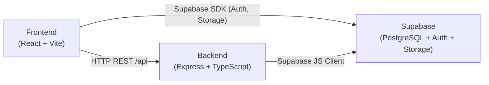

# InTEA — Regras de Arquitetura e Organização

> **Documento de referência obrigatório para todos os integrantes da equipe e agentes de IA que contribuírem com este projeto.**
> Toda nova funcionalidade, migração ou refatoração deve seguir rigorosamente as convenções descritas aqui.

---

## Índice

1. [Visão Geral da Arquitetura](#1-visão-geral-da-arquitetura)
2. [Banco de Dados (Database)](#2-banco-de-dados-database)
3. [Back-end (Backend)](#3-back-end-backend)
4. [Front-end (Frontend)](#4-front-end-frontend)
5. [Convenções de Nomenclatura](#5-convenções-de-nomenclatura)
6. [Regras de Git e Branches](#6-regras-de-git-e-branches)
7. [CI/CD e Testes Automatizados](#7-cicd-e-testes-automatizados)
8. [Segurança e Variáveis de Ambiente](#8-segurança-e-variáveis-de-ambiente)

---

## 1. Visão Geral da Arquitetura

O InTEA é uma aplicação **monorepo** com três camadas independentes:

``` Pastes
InTEA/
├── Backend/        # API RESTful — Node.js + Express + TypeScript
├── Frontend/       # SPA — React 19 + Vite + TypeScript + Tailwind v4
├── Database/       # Schema e Migrações SQL — PostgreSQL via Supabase
├── docs/           # Documentação técnica e sprints
└── docker-compose.yml
```



### Regras Fundamentais

- **Sem monólito:** cada camada tem responsabilidade única e deve ser deployável de forma independente.
- **TypeScript estrito em toda a stack.** Tipos `any` são proibidos.
- **Nenhum segredo** (chaves de API, senhas, connection strings) jamais deve ser commitado. Utilize sempre `.env` e `.env.example`.
- **Supabase é o banco de dados, o serviço de autenticação e o storage de arquivos.** Não implemente autenticação manual.

---

## 2. Banco de Dados (Database)

### 2.1 Estrutura de Diretórios

``` Pastes
Database/
├── database.sql          # ← Schema mestre (Single Source of Truth para fresh deploy)
└── migrations/
    ├── 001_*.sql         # ← Migração 001: Pacientes, UUID
    ├── 002_*.sql         # ← Migração 002: Terapeutas, Áreas de Foco
    └── NNN_descricao.sql # ← Próximas migrações
```

### 2.2 Regras de Schema

| Regra | Detalhe |
| :--- | :--- |
| **PKs sempre UUID** | `id UUID PRIMARY KEY DEFAULT gen_random_uuid()`. Nunca usar `BIGSERIAL` ou `INT`. |
| **FKs sempre UUID** | Toda chave estrangeira deve referenciar um `UUID`. |
| **Timestamps padrão** | Toda tabela deve ter `created_at TIMESTAMPTZ DEFAULT TIMEZONE('utc', NOW()) NOT NULL` e `updated_at` quando aplicável. |
| **Soft Delete** | Tabelas clínicas (`anotacao_clinica`, `relatorio_sessao`) usam `soft_delete BOOLEAN DEFAULT FALSE`. Hard DELETE é bloqueado por trigger (`impedir_hard_delete_clinico`). |
| **RLS obrigatório** | `ALTER TABLE ... ENABLE ROW LEVEL SECURITY` deve ser aplicado a **todas** as tabelas. Nunca deixar tabela sem política. |
| **Sem dados sensíveis sem restrição** | Colunas como `cpf` devem ter `UNIQUE` + índice (`idx_paciente_cpf`). |
| **Sem colunas BLOB** | Arquivos (PDF, DOCX) **nunca** são armazenados no banco. Use o **Supabase Storage** com bucket privado e signed URLs. |

### 2.3 Regras de Migração

1. **Nunca editar** uma migration já executada no Supabase. Crie sempre uma nova.
2. O nome do arquivo segue o padrão: `NNN_descricao_snake_case.sql` (ex: `003_add_sessao_status.sql`).
3. Toda migração deve ser **idempotente**: use `IF NOT EXISTS`, `ON CONFLICT DO NOTHING`, blocos `DO $$ ... END $$` com verificações antes de alterar tipos.
4. O arquivo `database.sql` é atualizado sincronamente com cada migration executada (é o schema para novos projetos do zero).
5. Scripts de migração devem ter **comentários explicativos** em cada bloco (`PASSO 1`, `PASSO 2`...).

### 2.4 Tabelas Existentes

| Tabela | Responsabilidade |
| :--- | :--- |
| `clinica` | Clínica/instituição de saúde |
| `terapeuta` | Perfil do terapeuta (espelha `auth.users`) |
| `areas_foco` | Catálogo de áreas de especialização do terapeuta |
| `terapeuta_area_foco` | Vínculo N:N terapeuta ↔ área |
| `paciente` | Dados sociodemográficos do paciente |
| `responsavel` | Responsável legal do paciente |
| `paciente_responsavel` | Vínculo N:N paciente ↔ responsável (`principal` ou `extra`) |
| `dados_clinicos` | Dados clínicos 1:1 com paciente |
| `gatilhos` | Catálogo de gatilhos sensoriais |
| `paciente_gatilho` | Vínculo N:N paciente ↔ gatilho (com severidade) |
| `laudo_clinico` | Metadados de laudos no Supabase Storage |
| `terapeuta_paciente` | Vínculo N:N terapeuta ↔ paciente |
| `jogo` | Catálogo de jogos terapêuticos |
| `sessao` | Sessão de jogo (clínica ou modo livre) |
| `anotacao_clinica` | Anotações de prontuário (soft delete, RN05) |
| `relatorio_sessao` | Relatório consolidado de sessão (soft delete, RN05) |

### 2.5 Funções e Helpers de RLS

- `public.check_is_super_admin()` → Verifica se o usuário autenticado é super admin.
- `public.terapeuta_tem_acesso_paciente(p_paciente_id UUID)` → Verifica vínculo ativo em `terapeuta_paciente`.

> [!CAUTION]
> Nunca remova ou altere a assinatura dessas funções sem atualizar **todas** as políticas que as referenciam.

---

## 3. Back-end (Backend)

### 3.1 Stack

| Tecnologia | Versão | Uso |
| :--- | :--- | :--- |
| Node.js | LTS | Runtime |
| TypeScript | ^7.x | Linguagem (strict mode) |
| Express | ^4.x | Framework HTTP |
| Supabase JS | ^2.x | Cliente do banco/auth |
| Socket.IO | ^4.x | WebSocket (sessões em tempo real) |
| Vitest | ^5.x | Testes unitários |

### 3.2 Estrutura de Diretórios

``` Pastes
Backend/
├── src/
│   └── server.ts             # Ponto de entrada: Express, CORS, Swagger UI e registro do apiRouter
├── api/
│   ├── index.ts              # apiRouter central — registra rotas das features (/paciente, /terapeuta, etc.)
│   └── {feature}/            # Ex: paciente/, terapeuta/, jogo/
│       ├── controllers/
│       │   └── {feature}.controller.ts
│       ├── models/
│       │   └── {feature}.model.ts
│       ├── routes/
│       │   └── {feature}.routes.ts  # Endpoints REST e anotações Swagger @swagger
│       ├── dtos/             # Data Transfer Objects
│       │   └── {feature}.dto.ts
│       └── test/
│           └── {feature}.test.ts
├── core/
│   ├── middlewares/
│   │   └── auth.middleware.ts  # Validação de token Bearer JWT via Supabase Auth
│   └── supabase/
│       └── supabase.client.ts  # Instância singleton do Supabase com SERVICE_ROLE_KEY
└── package.json
```

### 3.3 Padrão de Arquitetura: MVC

O Back-end segue estritamente o padrão **MVC (Model-View-Controller)**. No contexto de API REST, a "View" é a resposta JSON.

``` Paste
HTTP Request
    ↓
routes/{feature}.routes.ts      # Define verbos HTTP e mapeia para o Controller
    ↓
controllers/{feature}.controller.ts  # Extrai dados da req, chama o Model, devolve res
    ↓
models/{feature}.model.ts       # Contém toda a lógica de acesso ao banco (Supabase)
    ↓
core/supabase/supabase.client.ts # Singleton do cliente Supabase
```

#### Responsabilidades por camada

| Camada | Faz | Não Faz |
| :--- | :--- | :--- |
| **Route** | Define verbos HTTP (`GET`, `POST`, etc.) e registra middlewares | Contém lógica de negócio |
| **Controller** | Extrai e valida dados da `req`, chama o Model, formata o `res` | Acessa banco diretamente |
| **Model** | Executa queries no Supabase, trata erros de banco | Acessa `req` ou `res` |
| **DTO** | Define a interface TypeScript de entrada (body, params, query) | Contém lógica |

### 3.4 Regras de Controller

```typescript
// ✅ CORRETO
export class PacienteController {
  static async criar(req: Request, res: Response): Promise<void> {
    try {
      const dto: CriarPacienteDTO = req.body;
      // Validação básica aqui (campos obrigatórios)
      const paciente = await PacienteModel.criar(dto);
      res.status(201).json({ data: paciente });
    } catch (error) {
      res.status(500).json({ error: 'Erro ao criar paciente' });
    }
  }
}
```

- Todo método de controller deve ser `static async`.
- Sempre envolver em `try/catch`.
- Retornar sempre `{ data: ... }` para sucesso e `{ error: '...' }` para erro.
- Status HTTP corretos: `200` listagem/busca, `201` criação, `400` validação, `401` sem auth, `403` sem permissão, `404` não encontrado, `500` erro interno.

### 3.5 Regras de Model

```typescript
// ✅ CORRETO
export class PacienteModel {
  static async criar(dto: CriarPacienteDTO) {
    const { data, error } = await supabase
      .from('paciente')
      .insert(dto)
      .select()
      .single();

    if (error) throw new Error(error.message);
    return data;
  }

  static async desativar(id: string) {
    // Soft Delete: NUNCA usa .delete() em entidade clínica
    const { data, error } = await supabase
      .from('paciente')
      .update({ status_ativo: false, updated_at: new Date().toISOString() })
      .eq('id', id)
      .select()
      .single();

    if (error) throw new Error(error.message);
    return data;
  }
}
```

- Toda query ao Supabase verifica `error` e lança exceção em caso de falha.
- **Soft Delete:** Tabelas clínicas nunca usam `.delete()`. Use `.update({ status_ativo: false })` ou `.update({ soft_delete: true })`.
- Métodos de listagem sempre filtram `status_ativo: true` por padrão.

### 3.6 Regras de DTO

```typescript
// dtos/paciente.dto.ts
export interface CriarPacienteDTO {
  nome: string;
  data_nascimento: string;     // ISO 8601: "YYYY-MM-DD"
  clinica_id: string;          // UUID
  cpf?: string;
  telefone?: string;
  // ...
}

export interface AtualizarPacienteDTO {
  nome?: string;
  telefone?: string;
  // Nunca inclua id, created_at, clinica_id em update DTO
}
```

- DTOs de criação (`Criar...DTO`) têm campos obrigatórios sem `?`.
- DTOs de atualização (`Atualizar...DTO`) têm todos os campos como opcionais (`?`), pois PATCH parcial é padrão.
- DTOs nunca incluem `id`, `created_at`, `updated_at` — esses são gerados pelo banco.
- Para datas: sempre `string` no formato ISO 8601 (`YYYY-MM-DD` ou `YYYY-MM-DDTHH:mm:ssZ`).

### 3.7 Registrar uma Nova Feature

1. Criar pasta `api/{feature}/` com as subcamadas (`controllers`, `models`, `routes`, `test`).
2. Exportar as rotas em `api/{feature}/routes/{feature}.routes.ts` com anotações `@swagger`.
3. **Importar e registrar** em `api/index.ts` usando o nome do recurso no **singular**:

   ```typescript
   apiRouter.use('/auth', authRoutes);
   apiRouter.use('/paciente', pacienteRoutes);
   apiRouter.use('/terapeuta', terapeutaRoutes);
   ```

### 3.8 Testes Automatizados

- Framework: **Vitest**.
- Todo Model deve ter seu arquivo de teste em `api/{feature}/test/{feature}.test.ts`.
- Testes unitários validam lógica de CRUD, soft delete, hard delete e auth de forma isolada.
- Executar com: `npm test` no diretório `Backend/`.

### 3.9 Documentação Interativa com Swagger UI / OpenAPI

O projeto utiliza **Swagger UI** (`swagger-ui-express` + `swagger-jsdoc`) para documentação viva e testes de endpoints.

- **URL de Acesso:** `http://localhost:3000/api/docs`
- **Regras de Documentação:**
  - A documentação de cada rota vive **exclusivamente** em cima do método no arquivo `{feature}.routes.ts` usando blocos `/** @swagger ... */`.
  - **Não poluir o `server.ts`** com definições manuais de schemas. O `server.ts` deve apenas carregar os arquivos via glob (`./dist/api/**/*.routes.js` e `./api/**/*.routes.ts`).
  - As requisições usam **exemplos JSON diretos** (`example: { ... }`) facilitando o teste via botão *"Try it out"*.
  - A seção de Schemas no rodapé do Swagger UI é ocultada via `defaultModelsExpandDepth: -1`.
- **Botão Authorize (JWT):**
  - O Swagger possui o botão **`Authorize 🔓`** habilitado no topo direito via `securitySchemes: { bearerAuth: { type: 'http', scheme: 'bearer', bearerFormat: 'JWT' } }`.
  - Basta fazer login em `POST /api/terapeuta/login`, copiar o `access_token` retornado e colar no botão Authorize para testar rotas protegidas.

### 3.10 Autenticação JWT e Middleware de Segurança

- O sistema utiliza **Tokens JWT** emitidos pelo Supabase Auth.
- Para proteger uma rota privada, utiliza-se o middleware `authMiddleware`:
  ```typescript
  import { authMiddleware } from '../../../core/middlewares/auth.middleware.js';

  // Rota protegida por autenticação JWT:
  authRoutes.get('/me', authMiddleware, AuthController.me);
  ```
- O middleware:
  1. Extrai o token do cabeçalho `Authorization: Bearer <token>`.
  2. Valida o token com `supabase.auth.getUser(token)`.
  3. Injeta os dados do usuário autenticado em `req.user`.
  4. Retorna `401 Unauthorized` caso o token seja inválido, ausente ou expirado.

---

## 4. Front-end (Frontend)

### 4.1 Stack

| Tecnologia | Versão | Uso |
| :--- | :--- | :--- |
| React | ^19.x | UI Framework |
| TypeScript | ~5.9.x | Linguagem (strict mode) |
| Vite | ^7.x | Build tool e dev server |
| Tailwind CSS | ^4.x | Estilização utilitária |
| React Router DOM | ^7.x | Roteamento SPA |
| Zustand | ^5.x | Gerenciamento de estado global |
| Supabase JS | ^2.x | Auth e Storage direto no cliente |
| Radix UI + shadcn | ^1.x | Componentes acessíveis |
| Vitest | ^5.x | Testes de componentes/hooks |

### 4.2 Estrutura de Diretórios

``` Paste
Frontend/src/
├── core/                       # Configuração global da aplicação
│   ├── endpoints.ts            # Constantes das URLs da API (ex: /api/pacientes)
│   ├── settings.ts             # Configurações globais (timeout, base URL)
│   └── web.socket.ts           # Configuração do WebSocket (Socket.IO client)
├── features/                   # Módulos por domínio de negócio
│   ├── auth/
│   │   ├── hooks/              # useAuth(), useSession()
│   │   ├── service/            # auth.service.ts (chamadas Supabase Auth)
│   │   └── store/              # authStore.ts (Zustand)
│   └── {feature}/              # Ex: pacientes/, terapeutas/, jogos/
│       ├── components/         # Componentes locais da feature
│       ├── hooks/              # Hooks personalizados (useListarPacientes, etc.)
│       ├── pages/              # Páginas da feature (rotas)
│       ├── service/            # Chamadas à API Backend
│       └── store/              # Estado Zustand da feature
├── shared/                     # Compartilhado entre features
│   ├── components/
│   │   └── ui/                 # Componentes base (Button, Input, Card, Modal, Table...)
│   ├── lib/                    # Utilitários (formatters, validators, cn())
│   ├── providers/              # Providers globais (ThemeProvider, etc.)
│   └── types/                  # Interfaces TypeScript globais
│       ├── api/                # Tipos de respostas da API
│       └── auth/               # Tipos de autenticação
├── layout/                     # Estrutura de layout da aplicação
│   └── LayoutExample.tsx
├── App.tsx                     # Configuração de rotas e providers raiz
├── main.tsx                    # Ponto de entrada React
└── styles/                     # Estilos globais e tokens do Tailwind
```

### 4.3 Regras de Organização de Feature

Toda nova feature **deve** seguir a estrutura modular abaixo. Nada de arquivos soltos na raiz de `features/`:

``` Pastes
features/pacientes/
├── components/
│   ├── PacienteCard.tsx
│   └── PacienteForm.tsx
├── hooks/
│   └── usePacientes.ts
├── pages/
│   ├── PacientesListPage.tsx
│   └── PacienteCadastroPage.tsx
├── service/
│   └── paciente.service.ts
└── store/
    └── pacienteStore.ts
```

### 4.4 Regras de Componentes

```tsx
// ✅ CORRETO: Componente com props tipadas, exportação nomeada
interface PacienteCardProps {
  nome: string;
  idade: number;
  statusAtivo: boolean;
}

export function PacienteCard({ nome, idade, statusAtivo }: PacienteCardProps) {
  return (
    <div className="rounded-lg border p-4">
      <h3 className="font-semibold">{nome}</h3>
      <p>{idade} anos</p>
    </div>
  );
}
```

- **Exportação nomeada** (não default) para todos os componentes.
- Props sempre tipadas com `interface`.
- Estilização **exclusivamente** via Tailwind CSS. Nada de `style={{}}` inline ou arquivos `.css` por componente.
- Componentes de UI reutilizáveis vivem em `shared/components/ui/`.
- Componentes específicos de uma feature vivem em `features/{feature}/components/`.

### 4.5 Regras de Service (chamadas à API)

```typescript
// features/pacientes/service/paciente.service.ts
const BASE = '/api/pacientes';

export const PacienteService = {
  async listar(): Promise<Paciente[]> {
    const res = await fetch(`${BASE}`);
    if (!res.ok) throw new Error('Erro ao listar pacientes');
    const json = await res.json();
    return json.data;
  },

  async criar(dto: CriarPacienteDTO): Promise<Paciente> {
    const res = await fetch(`${BASE}`, {
      method: 'POST',
      headers: { 'Content-Type': 'application/json' },
      body: JSON.stringify(dto),
    });
    if (!res.ok) throw new Error('Erro ao criar paciente');
    const json = await res.json();
    return json.data;
  },
};
```

- URLs de API definidas em `core/endpoints.ts` como constantes.
- Services são objetos com métodos, não classes.
- Sempre verificar `res.ok` e lançar erro em caso de falha.
- Nunca colocar lógica de fetch dentro de componentes ou hooks diretamente — encapsule no service.

### 4.6 Regras de Store (Zustand)

```typescript
// features/pacientes/store/pacienteStore.ts
interface PacienteState {
  pacientes: Paciente[];
  isLoading: boolean;
  error: string | null;
  setPacientes: (p: Paciente[]) => void;
  setLoading: (v: boolean) => void;
}

export const usePacienteStore = create<PacienteState>((set) => ({
  pacientes: [],
  isLoading: false,
  error: null,
  setPacientes: (p) => set({ pacientes: p }),
  setLoading: (v) => set({ isLoading: v }),
}));
```

- Zustand para estado **global** (dados compartilhados entre páginas).
- `useState` do React para estado **local** (visibilidade de modal, formulário controlado).
- Nunca colocar lógica de fetch dentro da store — use hooks que chamam o service e atualizam a store.

### 4.7 Regras de Hook

```typescript
// features/pacientes/hooks/usePacientes.ts
export function usePacientes() {
  const { setPacientes, setLoading } = usePacienteStore();

  useEffect(() => {
    setLoading(true);
    PacienteService.listar()
      .then(setPacientes)
      .catch(console.error)
      .finally(() => setLoading(false));
  }, []);

  return usePacienteStore((s) => s.pacientes);
}
```

- Hooks ficam em `features/{feature}/hooks/`.
- Hooks de listagem seguem o padrão `use{Entidade}s()`.
- Todo hook de dados deve gerenciar os estados `isLoading` e `error`.

---

## 5. Convenções de Nomenclatura

### Geral

| Tipo | Convenção | Exemplo |
| :--- | :--- | :--- |
| Arquivos TypeScript/TSX | `kebab-case` | `paciente.model.ts`, `PacienteCard.tsx` |
| Interfaces e Types | `PascalCase` | `CriarPacienteDTO`, `Paciente` |
| **Funções e Métodos de Classe** | **`camelCase` ("nomeNome")** | `deletarHard()`, `buscarPorId()`, `desativar()`, `reativar()` |
| Variáveis e instâncias | `camelCase` | `novoPaciente`, `isPacienteAtivo` |
| Constantes globais | `UPPER_SNAKE_CASE` | `MAX_UPLOAD_SIZE`, `PORT` |
| Componentes React | `PascalCase` | `PacienteCard`, `FormularioCadastro` |
| Tabelas SQL | `snake_case` | `paciente`, `terapeuta_paciente` |
| Colunas SQL / DTO payload | `snake_case` | `data_nascimento`, `status_ativo`, `clinica_id` |
| Endpoints REST (recursos) | `kebab-case` singular | `/api/paciente`, `/api/terapeuta`, `/api/jogo` |
| Sub-rotas de ação específica | Ação no final da URL | `DELETE /api/paciente/:id/hard`, `PATCH /api/paciente/:id/reativar` |

### Regra Estrita de `camelCase` no Código TypeScript

- **Métodos em Controllers, Models e Services**: devem usar **obrigatoriamente `camelCase`** (`"nomeNome"`).
  - ✅ **Correto:** `deletarHard()`, `buscarPorId()`, `desativar()`, `calcularMetricas()`
  - ❌ **Proibido:** `deletar_hard()`, `delete_hard()`, `buscar_por_id()`
- **Sub-rotas de ação**: quando um endpoint realiza uma ação secundária ou de exceção sobre um recurso (como reativação ou hard delete para testes), a ação vai no **final da URL após o `:id`**:
  - ✅ `DELETE /api/paciente/:id/hard`
  - ✅ `PATCH /api/paciente/:id/reativar`
  - ❌ `/api/paciente/hard/:id` (evitar inversão do padrão)

### Padrão de Arquivo por Camada (Backend)

| Camada | Padrão | Exemplo |
| :--- | :--- | :--- |
| Route | `{feature}.routes.ts` | `paciente.routes.ts` |
| Controller | `{feature}.controller.ts` | `paciente.controller.ts` |
| Model | `{feature}.model.ts` | `paciente.model.ts` |
| DTO | `{feature}.dto.ts` | `paciente.dto.ts` |
| Teste | `{feature}.test.ts` | `paciente.test.ts` |

---

## 6. Regras de Git e Branches

### Branches

| Branch | Finalidade |
| :--- | :--- |
| `main` | Produção. Código **testado e aprovado**. Só recebe via Pull Request. |
| `develop` | Integração. Base para novas features. |
| `{nome}-dev` | Branch pessoal de desenvolvimento. Ex: `marcos-dev`. |

### Convenção de Commit (Conventional Commits)

``` Tipo
<tipo>(<escopo>): <descrição curta em português>
```

| Tipo | Quando usar |
| :--- | :--- |
| `feat` | Nova funcionalidade |
| `fix` | Correção de bug |
| `refactor` | Refatoração sem mudança de comportamento |
| `docs` | Documentação |
| `test` | Adição ou correção de testes |
| `chore` | Configuração, build, dependências |
| `db` | Mudanças de schema/migration |

**Exemplos:**

``` Padrão de commit
feat(pacientes): adiciona endpoint POST /api/pacientes
fix(auth): corrige refresh de token expirado
db(migration): cria tabela responsavel e paciente_responsavel
test(pacientes): adiciona testes unitários do PacienteModel
```

### Regras de Pull Request

- Todo PR para `main` exige aprovação de ao menos 1 revisor.
- PRs devem passar no CI/CD (build + testes) antes do merge.
- Título do PR segue o mesmo padrão de commit.
- O PR deve referenciar o card/task do GitHub Projects.

---

## 7. CI/CD e Testes Automatizados

O pipeline de CI/CD roda no **GitHub Actions** apenas para a branch `main`.

### Etapas do Pipeline

1. **Checkout** do código.
2. **Instalação de dependências** (`npm ci`) para Backend e Frontend.
3. **Typecheck** (`tsc --noEmit`) para ambos.
4. **Testes** (`vitest run`) para ambos.
5. **Build de produção** para Backend (`tsc`) e Frontend (`vite build`).
6. **Build Docker** via `docker compose build`.

### Comandos por camada

| Ação | Backend | Frontend |
| :--- | :--- | :--- |
| Instalar | `npm ci` | `npm ci` |
| Typecheck | `npm run typecheck` | `npm run typecheck` |
| Testes | `npm test` | `npm test` |
| Build | `npm run build` | `npm run build` |
| Dev | `npm run dev` | `npm run dev` |

> [!IMPORTANT]
> **Nunca faça commit de código que falhe no typecheck ou nos testes.** Valide localmente antes de abrir PR.

---

## 8. Segurança e Variáveis de Ambiente

### Back-end (`Backend/.env`)

```env
PORT=3000
SUPABASE_URL=https://xxxx.supabase.co
SUPABASE_ANON_KEY=eyJ...
SUPABASE_SERVICE_ROLE_KEY=eyJ...  # Somente para operações admin
CORS_ORIGIN=http://localhost:5173
```

### Front-end (`Frontend/.env`)

```env
VITE_API_URL=http://localhost:3000/api
VITE_SUPABASE_URL=https://xxxx.supabase.co
VITE_SUPABASE_ANON_KEY=eyJ...
```

### Regras de Segurança e Arquitetura Híbrida

| Camada | Chave Utilizada | Papel e Segurança |
| :--- | :--- | :--- |
| **Back-end (Node.js)** | `SUPABASE_SERVICE_ROLE_KEY` | **Exclusiva do Backend.** O servidor é a autoridade de negócio; valida os dados via DTOs, aplica Soft Delete (RN05) e checa permissões via `authMiddleware` antes de persistir com poderes de servidor. Nunca expor ao Frontend. |
| **Front-end (React)** | `VITE_SUPABASE_ANON_KEY` | Chave pública embutida no bundle do navegador. Usada exclusivamente para login direto no Supabase Auth e upload/download de laudos no Supabase Storage (onde as políticas de RLS garantem a proteção do bucket). |

> [!IMPORTANT]
> **Por que o Backend usa a SERVICE_ROLE_KEY?**
> O Back-end é um ambiente seguro e privado. Se o Backend utilizasse a chave anônima (`anon_key`), o Supabase o enxergaria como um visitante anônimo não logado (`auth.uid() = NULL`) e o RLS bloquearia inserções no banco. A segurança do Backend é feita por seus próprios middlewares (`authMiddleware`) e validações de DTOs antes de persistir no banco.

### Supabase Storage (Laudos)

- Bucket `'laudos'` é **privado** (`public = false`).
- Acesso ao arquivo é feito exclusivamente via **Signed URL temporária** (60 segundos).
- O cliente **nunca** armazena a URL permanentemente — solicita uma nova a cada download.
- Tipos MIME permitidos: `application/pdf`, `application/msword`, `application/vnd.openxmlformats-officedocument.wordprocessingml.document`.
- Tamanho máximo: **15 MB** por arquivo.
